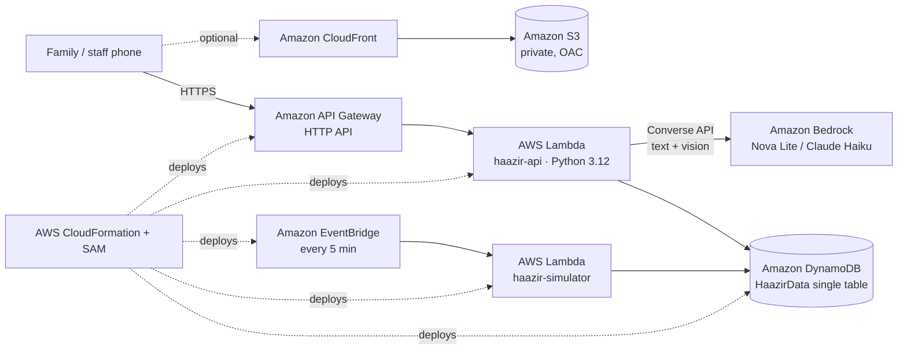

# Haazir (حاضر): Know before you go

**Live hospital beds, doctors on duty, ambulances, medicines, blood and working machines for Lahore, in one Urdu or English search.**

> ⚠️ **Pilot demo.** All availability data is **simulated**. It is not connected to any real hospital, pharmacy, blood bank or Rescue 1122. In an emergency, call **1122**.

**Live:** https://d1zq9eagbu3k0c.cloudfront.net (backup: https://1hm4lz3iy8.execute-api.us-east-1.amazonaws.com/) · Staff portal demo PIN: `1234`

Built for the AWS Builder Center **Zero to Shipped** hackathon. Category: **Social Good (Health)**. Lane: **Community**.

## What it does

| Module | What a family gets |
|---|---|
| 🔎 One search box | Urdu, Roman Urdu or English (typed or spoken). AI picks the need: bed, ambulance, medicine, blood, test, doctor |
| 🚨 Emergency triage | Danger signs (chest pain, breathing, unconscious, bleeding, stroke, seizure, injury, labour, burns) show a **Call Rescue 1122** banner first. It routes to a department and never diagnoses |
| 🛏️ Hospitals | Ranked by free beds in the needed department, specialist on duty, working machines, ER load and travel time, each with a one-line *why* |
| 🚑 Ambulance (demo) | Nearest free vehicle (ALS for danger signs), best destination hospital, **pre-arrival alert** to that hospital, live moving marker |
| 💊 Medicine | Stock at nearby pharmacies, cheaper **same-salt** alternatives, free hospital dispensaries, **prescription photo scan** that finds one pharmacy with everything |
| 🩸 Blood | Units per group at blood banks plus ABO/Rh-compatible groups, and a ready-to-forward **WhatsApp request** (English + Urdu) |
| 🩻 Equipment | Where CT / MRI / X-ray / dialysis / ventilator / oxygen is working right now, with queue estimates |
| 🧑‍⚕️ Staff portal | Big +/− controls, or **one Roman-Urdu message** (*"Medicine ward 3 mein 2 bed khali, CT kharab hai, Dr Sana 8 baje tak duty pe"*). AI turns it into a preview, staff confirm, and it's published |
| 🗺️ City dashboard | Map layers and totals for the health department / 1122 control room, refreshed every 15 seconds |

## Architecture



**Design principles**
1. **AI understands language; deterministic code decides.** Bedrock extracts intent and entities. Ranking is a transparent formula, shown to the user as a *why* line.
2. **Nothing breaks without AI.** Every Bedrock call has an 8 s timeout and a keyword fallback (`logic.keyword_understand`, `logic.keyword_parse_staff`). Red flags found by keywords can never be overridden by the model.
3. **Timestamps build trust.** Every resource carries `updatedAt` and `updatedBy`. Anything older than 2 h is greyed out as *may be outdated*.
4. **Emergencies escalate to Rescue 1122 first.** The demo ambulance is always labelled as simulated, next to a real `tel:1122` button.

## Data model (single DynamoDB table `HaazirData`)

| pk | sk | Item |
|---|---|---|
| `FACILITY#<id>` | `META` | type (hospital/pharmacy/bloodbank), name, lat/lon, sehatCard, femaleDoctor, open24h |
| `FACILITY#<id>` | `RES#bed#<dept>` | total, occupied |
| `FACILITY#<id>` | `RES#doctor#<key>` | name, dept, gender, onDuty, shiftEnds |
| `FACILITY#<id>` | `RES#equipment#<CT…>` | status working/busy/down, queue |
| `FACILITY#<id>` | `RES#medicine#<key>` | name, salt, strength, qty, inStock, priceRs |
| `FACILITY#<id>` | `RES#blood#<group>` | units |
| `AMBULANCE#<id>` | `META` | type basic/ALS, status, lat/lon, requestId |
| `REQUEST#<id>` | `META` | ambulance / blood requests and their timeline inputs |
| `ALERT#<facilityId>` | `<ts>#<id>` | pre-arrival and family alerts, ack |
| `STATS` | `GLOBAL` | searches, ambulanceRequests, medicineSearches, bloodRequests, estMinutesSaved… |

Every resource row also has `updatedAt` and `updatedBy`. One generic *facility + resource* model means every module reuses the same code.

## API

`POST /ask` · `GET /hospitals` · `GET /facility/{id}` · `GET /facilities` · `POST /ambulance/request` · `GET /ambulance/request/{id}` · `POST /notify` · `GET /medicine/search` · `POST /medicine/plan` · `POST /medicine/prescription` · `GET /blood/search` · `POST /blood/request` · `GET /equipment` · `POST /staff/login|parse|update|alerts|alerts/ack` · `GET /stats` · `GET /map` · `GET /health`

## Deploy

Requires the AWS CLI v2, signed in (`aws login`). No SAM CLI needed: the template is packaged and deployed with plain CloudFormation.

```powershell
.\deploy.ps1 -Seed        # first time: create stack + seed simulated data
.\deploy.ps1              # redeploy code
.\deploy.ps1 -Cdn         # also create private S3 + CloudFront (OAC)
.\deploy.ps1 -ModelId us.anthropic.claude-haiku-4-5-20251001-v1:0   # switch Bedrock model
```

Local preview with an in-memory fake table: `python tests/dev_server.py` → http://localhost:8765. Offline route test: `python tests/local_test.py`.

## Cost
On-demand DynamoDB, Lambda, HTTP API and EventBridge all sit in the free tier at pilot scale. Bedrock Nova Lite costs fractions of a cent per request.

## Honest limitations
Data is simulated. A real rollout needs hospital, pharmacy and blood bank partners, staff onboarding and verification of every update source. The demo staff PIN stands in for real authentication (Amazon Cognito would be next).
