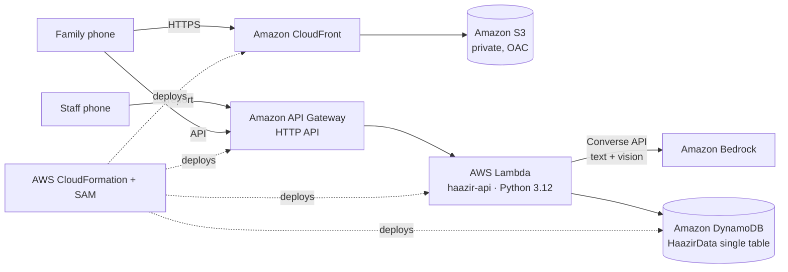

# Haazir (حاضر): Know before you go

**Beds, doctors on duty, machines, medicines and blood for Lahore's hospitals, reported by the people who know, searchable in one Urdu or English box.**

> **No invented data.** Hospitals, pharmacies and blood banks are real places in Lahore (OpenStreetMap, Wikipedia, public listings). Beds, doctors on duty, machine status, stock and blood units exist **only** once staff report them; until then the app shows "not reported yet". Not connected to any hospital system or to Rescue 1122 / Edhi. In an emergency, call **1122** or **115**.

**Live:** https://d1zq9eagbu3k0c.cloudfront.net (backup: https://1hm4lz3iy8.execute-api.us-east-1.amazonaws.com/) · Staff portal pilot PIN: `1234`

Built for the AWS Builder Center **Zero to Shipped** hackathon. Category: **Social Good (Health)**. Lane: **Community**.

## What it does

| Module | What it does |
|---|---|
| 🧑‍⚕️ Staff reporting | One Roman-Urdu/Urdu/English message (*"Medicine ward mein 2 bed khali, CT kharab hai, Dr Sana 8 baje tak duty pe"*) becomes a preview of structured updates. Staff confirm and it's published with a timestamp. +/− controls are also available |
| 🔎 Family search | Urdu, Roman Urdu or English, typed or spoken. AI picks the need: bed, ambulance, medicine, blood, test or doctor |
| 🚨 Emergency triage | Danger signs show **Rescue 1122** and **Edhi 115** first, plus "Tell the hospital you're coming". Routes to a department; never diagnoses |
| 🛏️ Hospitals | 19 real hospitals (10 government, 9 private) ranked by **reported** free beds, specialist on duty, machine status and travel time, with a *why* line. Unreported data is neutral |
| 🔔 Pre-arrival alerts | Family/ambulance alerts appear in the hospital's staff portal with ETA and a reference code |
| 💊 Medicine | Real brand → ingredient mapping, same-salt alternatives, reported stock at 71 real OpenStreetMap pharmacies, prescription photo scan (Bedrock vision) → one pharmacy with everything |
| 🩸 Blood | 6 real blood banks, reported units per group, ABO/Rh compatibility, WhatsApp donor request (English + Urdu) |
| 🩻 Machines | Where CT / MRI / X-ray / dialysis / ventilator / oxygen is reported working |
| 🗺️ City dashboard | Reporting coverage, reported capacity, ERs reported full, machines reported down, blood units |

## Architecture



**Design principles**
1. **Never invent availability.** Unknown is "not reported yet" and ranks as neutral, never as zero.
2. **AI understands language; deterministic code decides.** Bedrock extracts intent and entities, and staff confirm AI-parsed reports before publishing.
3. **Nothing breaks without AI.** Every Bedrock call has an 8 s timeout and a keyword fallback (`logic.keyword_understand`, `logic.keyword_parse_staff`). Keyword red flags can't be overridden by the model.
4. **Timestamps build trust.** Every report carries `updatedAt` / `updatedBy`; reports older than 2 h are greyed out.

## Data model (single DynamoDB table `HaazirData`)

| pk | sk | Item |
|---|---|---|
| `FACILITY#<id>` | `META` | type (hospital/pharmacy/bloodbank), name, lat/lon, ownership, departments, locationPrecision, source |
| `FACILITY#<id>` | `RES#bed#<dept>` | free (reported) |
| `FACILITY#<id>` | `RES#doctor#<key>` | name, dept, gender, onDuty, shiftEnds (reported) |
| `FACILITY#<id>` | `RES#equipment#<CT…>` | status working/busy/down (reported) |
| `FACILITY#<id>` | `RES#medicine#<key>` | qty, priceRs (reported by pharmacist) |
| `FACILITY#<id>` | `RES#blood#<group>` | units (reported) |
| `ALERT#<facilityId>` | `<ts>#<id>` | pre-arrival alerts, ack |
| `REQUEST#<id>` | `META` | blood donor requests |
| `STATS` | `GLOBAL` | searches, staffUpdates, notifications… |

Every `RES#` row has `updatedAt` and `updatedBy`. Only `META` rows are seeded.

## Data sources
- Hospitals: names + coordinates checked against OpenStreetMap (Nominatim/Overpass) and Wikipedia/Wikidata.
- Pharmacies: OpenStreetMap `amenity=pharmacy` in Lahore (© OpenStreetMap contributors, ODbL) → `backend/osm_pharmacies.py`.
- Blood banks: public listings (e.g. Zameen.com's list of Lahore blood banks) + OpenStreetMap; area-level locations are marked approximate.

## API

`POST /ask` · `GET /hospitals` · `GET /facility/{id}` · `GET /facilities` · `GET /helplines` · `POST /notify` · `GET /medicine/search` · `POST /medicine/plan` · `POST /medicine/prescription` · `GET /blood/search` · `POST /blood/request` · `GET /equipment` · `POST /staff/login|parse|update|alerts|alerts/ack` · `GET /stats` · `GET /map` · `GET /health`

## Deploy

Requires the AWS CLI v2, signed in (`aws login`). No SAM CLI needed: the template is packaged and deployed with plain CloudFormation.

```powershell
.\deploy.ps1 -Seed        # create/update stack + reset to real reference data (deletes all reports)
.\deploy.ps1              # redeploy code only
.\deploy.ps1 -NoCdn       # without S3 + CloudFront
.\deploy.ps1 -ModelId us.anthropic.claude-haiku-4-5-20251001-v1:0   # switch Bedrock model
```

Local preview with an in-memory fake table: `python tests/dev_server.py` → http://localhost:8765. Tests: `python tests/local_test.py` (routes + "nothing invented" checks), `python tests/demo_story_test.py`.

## Honest limitations
The pilot PIN is shared so judges can try reporting, so anyone can post a report. A real rollout needs verified staff accounts (Amazon Cognito), partner facilities and an audit trail. Department lists are each hospital's main publicly known departments, not a verified complete list.
