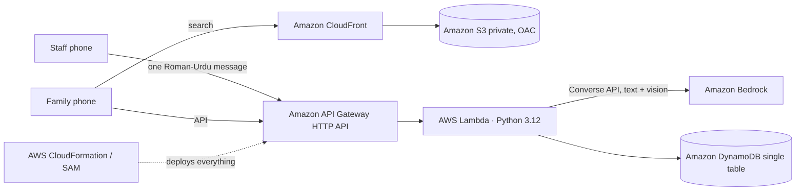

# Haazir: Know before you go. Beds, doctors, machines, medicines and blood for Lahore's hospitals, reported by the people who know

**🔗 Live app:** https://d1zq9eagbu3k0c.cloudfront.net (backup: https://1hm4lz3iy8.execute-api.us-east-1.amazonaws.com/)
**Category:** Social Good (Health: access to quality health services) · **Lane:** Community
**Tags:** #social-good #community
**Try it:** type *"abbu ko seenay mein dard"* on the home page · Staff portal pilot PIN: **1234**

> **Real places, clearly-labelled demo numbers.** Every hospital, pharmacy and blood bank in Haazir is a real place in Lahore. Because no hospital reports to Haazir yet, the live site starts in **Demo mode**: availability numbers are sample data, tagged **🧪 demo sample** on every card. Switch **Demo data** off in the header to see only real staff reports. Any real staff report immediately replaces the demo value for that item.

---

## The night that started this

[Write 3–5 sentences of your own story here. For example: when, which family member, which hospital in Lahore.]

We reached [hospital name] at [time]. There was no bed, so patients were lying on the floor of the corridor. The [specialist] wasn't on duty. The CT machine was "kharab". The medicine the doctor prescribed wasn't at any of the [number] pharmacies we tried nearby. And in the middle of all that, our family WhatsApp group filled up with forwards: *"Urgent: O-negative blood needed."*

Nobody was being careless. **The information we needed existed. It just wasn't anywhere we could reach it.** The ward staff knew which beds were free. The pharmacist knew what was in stock. The blood bank clerk knew how many O-negative units were left. Nothing connected them to the family standing at the gate.

So we lost the one thing you can't get back in an emergency: **time.** We drove from hospital to hospital, phoned around and posted appeals.

## The gap

- Availability lives in people's heads: ward staff, pharmacists, radiology desks, blood bank clerks. **There is no public live source for it in Lahore.** I checked while building this.
- Families find out **after** they arrive.
- Any fix fails if updating is hard. A busy ward nurse won't fill in a 20-field form, but she will send a one-line WhatsApp-style message.

So Haazir is built around **the reporting side first**: one Roman-Urdu message from staff becomes structured, timestamped availability that families can search.

## What Haazir does

| | Module | What it does |
|---|---|---|
| 🧑‍⚕️ | **Staff reporting (the core)** | Staff pick their hospital, pharmacy or blood bank and type one message, like *"Medicine ward mein 2 bed khali, CT kharab hai, Dr Sana 8 baje tak duty pe"*. AI on Amazon Bedrock turns it into a preview ("Medicine: 2 free beds · CT: down · Dr Sana: on duty until 20:00"). Staff untick anything wrong and tap Confirm. Big +/− buttons are also available. Each report is stamped with time and source. |
| 🔎 | **One search box for families** | Urdu, Roman Urdu or English, typed or spoken. Haazir understands the need: bed, ambulance, medicine, blood, test or doctor. |
| 🚨 | **Emergency first** | Danger signs (chest pain, breathing difficulty, unconscious, heavy bleeding, stroke signs, seizure, severe injury, labour complications) show the **real helplines first: Rescue 1122 and Edhi 115**, plus "Tell the hospital you're coming". Haazir routes you to a department. It never diagnoses. |
| 🛏️ | **Hospitals** | **19 real Lahore hospitals: 10 government (free) and 9 private (fees apply)**, because in an emergency the nearest option matters. From Bahria Town, the nearest government hospital is ~50 min away but Bahria International is ~6 min. Ranked by reported free beds in the right department, specialist reported on duty, reported machine status and travel time, with a one-line **"why"**. If nothing is reported, they're ranked by department and distance, and Haazir says so. |
| 🔔 | **Pre-arrival alerts** | Families (or anyone coming by 1122/Edhi) tap **"Tell hospital you're coming"**. The alert appears in that hospital's staff portal with ETA and a reference code; staff acknowledge it. |
| 💊 | **Medicine** | **What each medicine is used for** and whether it **needs a doctor's prescription**, real brand → active-ingredient mapping, same-salt alternatives (with "confirm with your doctor or pharmacist"), stock at **real pharmacies from OpenStreetMap** once pharmacists report it. **Prescription photo scan**: AI reads the names, you confirm, and Haazir finds **one pharmacy that has reported having everything**, or the fewest stops. |
| 🩸 | **Blood** | **Real Lahore blood banks** (Sundas Foundation, Fatimid Foundation, Husaini, Red Crescent, LGH blood bank, Lahore Blood Bank at Aadil Hospital) with reported units per group, the standard ABO/Rh compatibility table, and a ready-to-forward **WhatsApp donor request** in English and Urdu. |
| 🩻 | **Machines** | Where CT, MRI, X-ray, dialysis, ventilators and oxygen are reported working. |
| 🗺️ | **City dashboard** | For the health department and emergency control rooms: map of real facilities coloured by reported capacity (grey = not reported), reporting coverage (e.g. "2/19 hospitals reporting"), ERs reported full, machines reported down, blood units. |

### Demo story (2 minutes)
1. **Family, before any report:** type **"abbu ko seenay mein dard"** → red banner with 1122 and Edhi 115 → nearest real hospitals with Cardiology, honestly marked "beds not reported yet".
2. **Staff report:** Staff → Punjab Institute of Cardiology → PIN 1234 → Quick update → *"Cardiology ward mein 4 bed khali, Dr Ayesha 10 baje tak duty pe"* → Preview → Confirm.
3. **Family, after the report:** run the same search again. PIC now ranks first: "staff report 4 free Cardiology beds, Dr Ayesha reported on duty · 7 min away", with the report time.
4. **Tell hospital you're coming** → the alert appears in PIC's staff portal → Acknowledge.
5. **Pharmacy** reports *"Panadol khatam, Augmentin 20 packs aa gaye"* → a family's **Medicine → Augmentin** search finds it.
6. **Blood → O- → Create request & share** → WhatsApp message ready.

[screenshot: home] [screenshot: emergency results before report] [screenshot: staff quick update preview] [screenshot: results after report] [screenshot: city dashboard]

## How it works (all on AWS)

- **AWS Lambda** (Python 3.12, arm64): one router function for the whole API; it can also serve the site directly.
- **Amazon API Gateway (HTTP API)**: public HTTPS endpoint with CORS and throttling.
- **Amazon DynamoDB** (on-demand): one generic *facility + reported resource* model (beds, doctors, equipment, medicine, blood). Every report row has `updatedAt` / `updatedBy`.
- **Amazon Bedrock (Converse API)**: intent understanding, triage extraction, staff-message parsing, prescription **vision** reading, short Urdu/English explanations.
- **Amazon S3 + Amazon CloudFront (Origin Access Control)**: private bucket, HTTPS, edge caching for the site.
- **AWS CloudFormation + SAM**: the whole stack is one template, deployed from the AWS CLI.

### Design principles
1. **Never invent availability.** Real facilities only. Unknown is shown as "not reported yet", and the ranking treats it as neutral, never as zero.
2. **AI understands language; a transparent formula decides.** Bedrock never picks the hospital. The ranking is deterministic and explained.
3. **Humans confirm AI.** Staff see a preview of what the AI understood and untick mistakes before anything is published.
4. **Nothing breaks without AI.** Every Bedrock call has an 8-second timeout and a keyword fallback. A danger sign caught by keywords can't be overridden by the model.
5. **Timestamps build trust.** Every report shows when it was made; anything older than 2 hours is greyed out as "may be outdated".
6. **Real helplines first.** Emergencies always show Rescue 1122 and Edhi 115. Haazir does not dispatch ambulances.
7. **Safe medicine switching.** Alternatives are only the same active ingredient and strength.

## What's real, and the honest limitations
- **Real:** 19 hospitals (names, locations checked against OpenStreetMap/Wikipedia, main departments), 71 pharmacies (OpenStreetMap), 6 blood banks (public listings; 4 locations are neighbourhood-level and marked "approximate location"), medicine brand → ingredient mapping, ABO/Rh table, helpline numbers.
- **Demo sample data:** bed counts, doctors on duty (fictional names), machine status, pharmacy stock and blood units shown in Demo mode are sample data for demonstration, each tagged 'demo sample'. With Demo data switched off, only real staff reports are shown and everything else reads 'not reported yet'.
- **Reported, not real-time integrated:** availability comes only from staff using the portal. In this pilot the staff PIN is shared (1234) so judges can try it, which means anyone could post a report. A real rollout needs verified staff accounts (Amazon Cognito) and partner hospitals, pharmacies and blood banks.
- **Not connected** to any hospital IT system or to Rescue 1122 / Edhi dispatch. Phone numbers for facilities are not shown because I couldn't verify them.
- My AWS account was brand new and still being verified during the hackathon, so Bedrock returned "account being verified" / daily-quota errors for part of the build. The keyword fallback kept every feature working. [Update this line if Bedrock started working before you submitted.]

## Impact & what's next
- **For families:** fewer wasted trips. Know before you go, or at least know what's *not* known and call ahead.
- **For hospitals:** pre-arrival alerts, so the ER knows a cardiac patient is 12 minutes away.
- **For the health department:** a live view of reporting coverage and capacity once facilities report.
- [verify] Add 1–2 sourced facts about Lahore/Punjab hospital load or blood shortages here, with links. Don't use numbers you haven't checked.

**Roadmap**
1. **Pilot:** one public hospital, 10 pharmacies and 1 blood bank in Lahore actually reporting.
2. **WhatsApp bot for staff:** the same AI parser over WhatsApp, so staff never open an app.
3. Verified staff accounts (Amazon Cognito), report audit trail, and a Punjab-wide rollout.
4. Apply for **AWS Social Impact Credits** to fund the pilot.

## How the coding agent helped me ship

I used **Claude Code** as my coding agent, **connected to my AWS account through the AWS CLI** (`aws login`, browser sign-in). [screenshot: `aws sts get-caller-identity` output with account ID masked]

What the agent did, from my build log (`proof/agent-log.md`):
- **Connected to AWS and checked the account**: `aws sts get-caller-identity`, listed Bedrock models (`aws bedrock list-inference-profiles`) and tested Claude Haiku 4.5 and Amazon Nova with the Converse API.
- **Adapted when the account was blocked:** Bedrock returned *"account is being verified"*, so it built an AI-with-fallback design where every feature still works.
- **Verified the data instead of inventing it:** looked up every hospital's real location on OpenStreetMap (Nominatim + Overpass) and Wikipedia (8 of 10 were corrected, one by 1.8 km), pulled 71 real pharmacies from OpenStreetMap, and found real blood banks from public listings. When I pointed out that simulated "0 beds / X-ray down" on real hospitals was misleading, it rebuilt the data model so availability exists **only** from staff reports, and it deleted 1,143 simulated rows from the live DynamoDB table.
- **Wrote the whole stack:** the SAM template (DynamoDB, Lambda, HTTP API, S3, CloudFront OAC, least-privilege IAM), the Python backend (triage, explainable ranking, set-cover pharmacy planner, ABO/Rh compatibility, staff-message parser with preview/confirm) and the bilingual Urdu/English RTL frontend with Leaflet maps.
- **Tested before shipping:** an offline test harness with a fake DynamoDB that checks every route **and that nothing is invented before a report**, plus a local preview server.
- **Deployed and debugged on AWS:** `aws cloudformation package/deploy`. When the Lambda failed with `No module named 'handler'`, it downloaded the deployed zip with `aws lambda get-function`, found the packaging bug, fixed the template and redeployed. Then it seeded the real facilities with `aws lambda invoke` and tested every live route.

[screenshot: CloudFormation stack "haazir" in the AWS console] [screenshot: DynamoDB table HaazirData] [screenshot: Lambda function]

---
**Live:** https://d1zq9eagbu3k0c.cloudfront.net (backup: https://1hm4lz3iy8.execute-api.us-east-1.amazonaws.com/) · **Category:** Social Good (Health) · **Lane:** Community · #social-good #community
