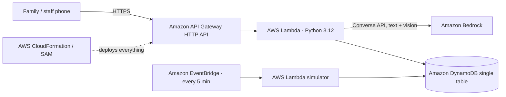

# Haazir: Know before you go. Live beds, doctors, ambulances, medicines and blood for Pakistan's hospitals

**🔗 Live app:** https://d1zq9eagbu3k0c.cloudfront.net (backup: https://1hm4lz3iy8.execute-api.us-east-1.amazonaws.com/)
**Category:** Social Good (Health: access to quality health services) · **Lane:** Community
**Tags:** #social-good #community
**Try it:** type *"abbu ko seenay mein dard"* on the home page · Staff portal demo PIN: **1234**

> Pilot demo: all availability data is simulated and clearly labelled as such in the app.

---

## The night that started this

[Write 3–5 sentences of your own story here. For example: when, which family member, which hospital in Lahore.]

We reached [hospital name] at [time]. There was no bed, so patients were lying on the floor of the corridor. The [specialist] wasn't on duty. The CT machine was "kharab". The medicine the doctor prescribed wasn't at any of the [number] pharmacies we tried nearby. And in the middle of all that, our family WhatsApp group filled up with forwards: *"Urgent: O-negative blood needed."*

Nobody was being careless. **The information we needed existed. It just wasn't anywhere we could reach it.** The ward staff knew which beds were free. The pharmacist knew what was in stock. The blood bank clerk knew how many O-negative units were left. Nothing connected them to the family standing at the gate.

So we lost the one thing you can't get back in an emergency: **time.** We drove from hospital to hospital, phoned around and posted appeals.

## The gap

- Availability lives in people's heads: ward staff, pharmacists, radiology desks, blood bank clerks.
- Families find out **after** they arrive.
- Any fix fails if updating is hard. A busy ward nurse won't fill in a 20-field form, but she will send a one-line WhatsApp-style message.

## What Haazir does

**One search box, in Urdu, Roman Urdu or English (typed or spoken), that tells you where care is actually available right now.**

| | Module | What it does |
|---|---|---|
| 🚨 | **Emergency first** | Danger signs (chest pain, breathing difficulty, unconscious, heavy bleeding, stroke signs, seizure, severe injury, labour complications) show a red **"Call Rescue 1122 now"** banner before anything else. Haazir routes you to a department. It never diagnoses. |
| 🛏️ | **Hospital beds & doctors** | Ranked by free beds in the right department, specialist on duty now (and until when), working machines, ER load and travel time, with a one-line **"why this hospital"**. Filters: Sehat Card, female doctor. |
| 🚑 | **Ambulance (demo network)** | Picks the nearest free vehicle (advanced life support for danger signs), chooses the best destination hospital, **alerts that hospital before arrival** with a one-line summary, and shows the ambulance moving on a live map. A real `tel:1122` button is always next to it. |
| 💊 | **Medicine** | Stock, quantity and price at nearby pharmacies, **cheaper same-salt alternatives**, and free hospital dispensary stock. **Scan a prescription photo**: AI reads the names, you confirm them, and Haazir finds **one pharmacy that has everything** (or the fewest stops) with a total cost. |
| 🩸 | **Blood** | Units of your group at blood banks, plus ABO/Rh-compatible groups (clearly labelled), and a ready-to-forward **WhatsApp request** in English and Urdu. |
| 🩻 | **Machines** | Where CT, MRI, X-ray, dialysis, ventilators and oxygen are **working right now**, with queue estimates. |
| 🧑‍⚕️ | **Staff portal** | Big +/− buttons, or one message like *"Medicine ward 3 mein 2 bed khali, CT kharab hai, Dr Sana 8 baje tak duty pe"*. AI turns it into a preview of changes, staff tap Confirm, and patients see it instantly. Incoming ambulance and family alerts appear here with Acknowledge. |
| 🗺️ | **City dashboard** | For the health department and the Rescue 1122 control room: a map of hospitals coloured by capacity, ambulances, pharmacies and blood banks, plus city totals, ERs at capacity, machines down, blood shortages and estimated minutes saved. |

### Demo story (2 minutes)
1. Type **"abbu ko seenay mein dard"** → red 1122 banner → cardiac hospitals ranked with reasons → **Request ambulance (demo)** → the ambulance moves on the map → "Hospital has been alerted".
2. Open **Staff → Mayo Hospital → PIN 1234 → Alerts**: the incoming ambulance is there. Go to **Quick update**, use the example Roman-Urdu message, then **Preview → Confirm**. The patient view changes.
3. **Medicine → Scan a prescription** → confirm the list → "One pharmacy has everything" with total cost.
4. **Blood → O- → Create request & share** → WhatsApp message ready.

[screenshot: home] [screenshot: emergency results] [screenshot: ambulance map] [screenshot: staff quick update] [screenshot: city dashboard]

## How it works (all on AWS)

- **AWS Lambda** (Python 3.12, arm64): one router function for the API that also serves the site, plus a simulator function.
- **Amazon API Gateway (HTTP API)**: public HTTPS endpoint with CORS and throttling.
- **Amazon DynamoDB** (on-demand): one generic *facility + resource* model (beds, doctors, equipment, medicine, blood) so every module reuses the same code. Every row has `updatedAt` / `updatedBy`.
- **Amazon Bedrock (Converse API)**: intent understanding, triage extraction, staff-message parsing, prescription **vision** reading, short Urdu/English explanations.
- **Amazon EventBridge Scheduler**: every 5 minutes the demo simulator nudges beds, rotates doctor shifts, changes stock and blood, flips machine status and moves idle ambulances, so the pilot feels alive.
- **AWS CloudFormation + SAM**: the whole stack is one template, deployed from the AWS CLI.
- **Amazon S3 + Amazon CloudFront (Origin Access Control)**: private bucket, HTTPS, global edge caching for the site.

### Design principles
1. **AI understands language; a transparent formula decides.** Bedrock never picks the hospital. The ranking (free beds, specialist on duty, machine working, ER load, ETA) is deterministic and explained to the user.
2. **Nothing breaks without AI.** Every Bedrock call has an 8-second timeout and a keyword fallback. A danger sign caught by keywords can't be overridden by the model.
3. **Timestamps build trust.** Every number shows "updated X min ago". Anything older than 2 hours is greyed out and marked "may be outdated".
4. **1122 first.** Emergencies always escalate to Rescue 1122. Simulated features are labelled as simulated.
5. **Safe medicine switching.** Alternatives are only the same active ingredient and strength, always with "Confirm with your doctor or pharmacist before switching."

## Honest limitations
- **All availability data in this pilot is simulated**, covering 10 major Lahore public hospitals (approximate real locations), 18 fictional pharmacies, 6 blood banks and 12 demo ambulances. Haazir is not connected to any real hospital, pharmacy, blood bank or Rescue 1122.
- A real rollout needs partners: hospitals, pharmacies and blood banks willing to update, plus verified staff accounts (the demo PIN would become Amazon Cognito sign-in).
- My AWS account was brand new and still being verified during the hackathon, so Bedrock calls returned "account being verified" for part of the build. The keyword fallback kept every feature working. [Update this line if Bedrock started working before you submitted.]

## Impact & what's next
- **For families:** fewer wasted trips. When the nearest hospital can't help, Haazir routes you elsewhere, and the dashboard counts the estimated minutes saved. Less phoning around, fewer frantic blood appeals.
- **For hospitals:** pre-arrival alerts, so the ER knows a cardiac patient is 12 minutes away.
- **For the health department and Rescue 1122:** for the first time, one live view of city-wide capacity: which ERs are full, which machines are down, which blood groups are short.
- [verify] Add 1–2 sourced facts about Lahore/Punjab hospital load or blood shortages here, with links. Don't use numbers you haven't checked.

**Roadmap**
1. **Pilot:** one public hospital + 10 pharmacies + 1 blood bank in Lahore.
2. **WhatsApp bot for staff updates:** the same AI parser, so staff never open an app.
3. **Punjab-wide rollout**, including the Sehat Card network.
4. Apply for **AWS Social Impact Credits** to fund the pilot.

## How the coding agent helped me ship

I used **Claude Code** as my coding agent, **connected to my AWS account through the AWS CLI** (`aws login`, browser sign-in). [screenshot: `aws sts get-caller-identity` output with account ID masked]

What the agent did, from my build log (`proof/agent-log.md`):
- **Connected to AWS and checked the account**: `aws sts get-caller-identity`, then listed the available Bedrock models (`aws bedrock list-inference-profiles`) and tested Claude Haiku 4.5 and Amazon Nova Lite with the Converse API.
- **Adapted when the account was blocked:** Bedrock returned *"account is being verified"*, so it designed an AI-with-fallback architecture where every feature still works, and it served the site directly from Lambda in case CloudFront was also blocked on the new account.
- **Wrote the whole stack:** the SAM template (DynamoDB, Lambda, HTTP API, EventBridge, IAM least-privilege policies), the Python backend (triage, explainable ranking, set-cover pharmacy planner, ABO/Rh compatibility, ambulance simulation, staff-message parser), the bilingual Urdu/English RTL frontend with Leaflet maps, and the realistic simulated seed data.
- **Tested before shipping:** built an offline test harness with a fake DynamoDB that exercises every API route, and a local preview server.
- **Deployed and debugged on AWS:** `aws cloudformation package/deploy`. When the Lambda failed with `No module named 'handler'`, it downloaded the deployed zip with `aws lambda get-function`, found the packaging bug, fixed the template and redeployed. Then it seeded 943 records with `aws lambda invoke` and curl-tested every live route.

[screenshot: CloudFormation stack "haazir" in the AWS console] [screenshot: DynamoDB table HaazirData] [screenshot: Lambda functions]

From an idea to a live, tested app on AWS in one night.

---
**Live:** https://d1zq9eagbu3k0c.cloudfront.net (backup: https://1hm4lz3iy8.execute-api.us-east-1.amazonaws.com/) · **Category:** Social Good (Health) · **Lane:** Community · #social-good #community
